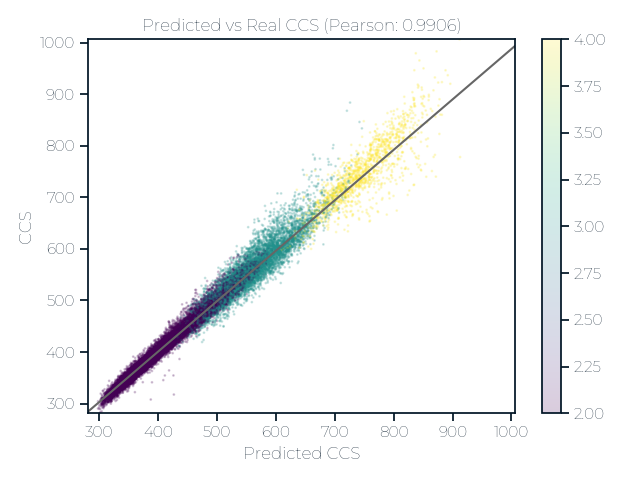

# Flimsy: Fun/Fast Simple IMS You can use

This repository implements a very simple LGBM model
to predict ion mobility from peptides.

## Performance





## Features

The features used for prediction are meant to be
simple and their implementation can be found here:
[flimsy/features.py](flimsy/features.py)

## Training 

Currently the training logic is handled using DVC (https://dvc.org).

```shell
git clone {this repo}
cd flimsy/train
dvc repro
```

Running this should automatically download the data,
trian the models, calculate and update the metrics.

