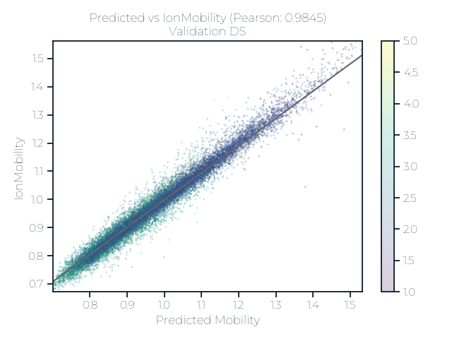

# Flimsy: Fun/Fast Simple IMS Anyone like You can use.
Sebastian Paez

This repository implements a very simple LGBM model to predict ion
mobility from peptides.

## Usage

There are two main ways to interact with `flimsay`, one is using python
and the other one is using the python api directly.

### CLI

``` shell
$ pip install flimsay
```

``` shell
$ flimsay fill_blib mylibrary.blib # This will add ion mobility data to a .blib file.
```

``` {shell}
$ flimsay fill_blib --help
```

### Python

#### Single peptide

``` python
from flimsay.model import FlimsayModel

model_instance = FlimsayModel()
model_instance.predict_peptide("MYPEPTIDEK", charge=2)
```

    {'ccs': array([363.98077702]), 'one_over_k0': array([0.92491103])}

#### Many peptides at once

``` python
import pandas as pd
from flimsay.features import add_features, FEATURE_COLUMNS

df = pd.DataFrame({"Stripped_Seqs": ["LESLIEK", "LESLIE", "LESLKIE"]})
df["PrecursorCharge"] = 2
df = add_features(df, stripped_sequence_name="Stripped_Seqs", calc_masses=True)
df
```

<div>
<style scoped>
    .dataframe tbody tr th:only-of-type {
        vertical-align: middle;
    }
&#10;    .dataframe tbody tr th {
        vertical-align: top;
    }
&#10;    .dataframe thead th {
        text-align: right;
    }
</style>

|     | Stripped_Seqs | PrecursorCharge | StrippedPeptide | PepLength | NumBulky | NumTiny | NumProlines | NumGlycines | NumPos | PosIndexL | PosIndexR | NumNeg | NegIndexL | NegIndexR | Mass       | PrecursorMz |
|-----|---------------|-----------------|-----------------|-----------|----------|---------|-------------|-------------|--------|-----------|-----------|--------|-----------|-----------|------------|-------------|
| 0   | LESLIEK       | 2               | LESLIEK         | 7         | 3        | 1       | 0           | 0           | 1      | 0.857143  | 0.000000  | 2      | 0.142857  | 0.142857  | 830.474934 | 416.245292  |
| 1   | LESLIE        | 2               | LESLIE          | 6         | 3        | 1       | 0           | 0           | 0      | 1.000000  | 1.000000  | 2      | 0.166667  | 0.000000  | 702.379971 | 352.197811  |
| 2   | LESLKIE       | 2               | LESLKIE         | 7         | 3        | 1       | 0           | 0           | 1      | 0.571429  | 0.285714  | 2      | 0.142857  | 0.000000  | 830.474934 | 416.245292  |

</div>

``` python
model_instance.predict(df[FEATURE_COLUMNS])
```

    {'ccs': array([314.81143905, 308.20013703, 313.45185519]),
     'one_over_k0': array([0.78866524, 0.72619415, 0.77991099])}

## Performance




## Motivation

There is a fair amount of data on CCS and ion mobility of peptides but
only very few models actually use features that are directly
interpretable.

In addition, having a simpler model allows faster predictions in systems
that are not equiped with GPUs.

Therefore, this project aims to create a freely available, easy to use,
interpretable and fast model to predict ion mobility and collisional
cross-section for peptides.

## Features

The features used for prediction are meant to be simple and their
implementation can be found here:
[flimsy/features.py](flimsy/features.py)

``` python
from flimsay.features import FEATURE_COLUMN_DESCRIPTIONS
for k,v in FEATURE_COLUMN_DESCRIPTIONS.items():
    print(f">>> The Feature '{k}' is defined as: \n\t{v}")
```

    >>> The Feature 'PrecursorMz' is defined as: 
        Measured precursor m/z
    >>> The Feature 'Mass' is defined as: 
        Measured precursor mass (Da)
    >>> The Feature 'PrecursorCharge' is defined as: 
        Measured precursor charge, from the isotope envelope
    >>> The Feature 'PepLength' is defined as: 
        Length of the peptide sequence in amino acids
    >>> The Feature 'NumBulky' is defined as: 
        Number of bulky amino acids (LVIFWY)
    >>> The Feature 'NumTiny' is defined as: 
        Number of tiny amino acids (AS)
    >>> The Feature 'NumProlines' is defined as: 
        Number of proline residues
    >>> The Feature 'NumGlycines' is defined as: 
        Number of proline residues
    >>> The Feature 'NumPos' is defined as: 
        Number of positive amino acids (KRH)
    >>> The Feature 'PosIndexL' is defined as: 
        Relative position of the first positive amino acid (KRH)
    >>> The Feature 'PosIndexR' is defined as: 
        Relative position of the last positive amino acid (KRH)
    >>> The Feature 'NumNeg' is defined as: 
        Number of negative amino acids (DE)
    >>> The Feature 'NegIndexL' is defined as: 
        Relative position of the first negative amino acid (DE)
    >>> The Feature 'NegIndexR' is defined as: 
        Relative position of the last negative amino acid (DE)

## Training

Currently the training logic is handled using DVC (https://dvc.org).

``` shell
git clone {this repo}
cd flimsay/train
dvc repro
```

Running this should automatically download the data, trian the models,
calculate and update the metrics.
